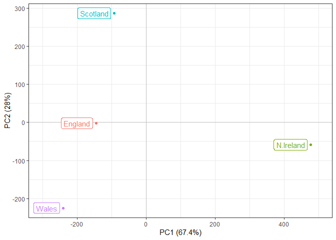

# Class 07 ML1
Neva Olliffe (PID A69026930)

\#Clustering

We’re starting with k-means clustering, one of the most prevalent of
clustering methods. It’s fast and does a lot for you.

Let’s make up some data.

``` r
tmp <- c(rnorm(30, mean = 3), rnorm(30, mean = -3))
x <- cbind(x = tmp, y = rev(tmp))
plot(x)
```


The main kmeans function is kmeans.

``` r
k <- kmeans(x, centers = 2, nstart = 20)
k
```

    K-means clustering with 2 clusters of sizes 30, 30

    Cluster means:
              x         y
    1 -3.042039  2.752312
    2  2.752312 -3.042039

    Clustering vector:
     [1] 2 2 2 2 2 2 2 2 2 2 2 2 2 2 2 2 2 2 2 2 2 2 2 2 2 2 2 2 2 2 1 1 1 1 1 1 1 1
    [39] 1 1 1 1 1 1 1 1 1 1 1 1 1 1 1 1 1 1 1 1 1 1

    Within cluster sum of squares by cluster:
    [1] 65.24053 65.24053
     (between_SS / total_SS =  88.5 %)

    Available components:

    [1] "cluster"      "centers"      "totss"        "withinss"     "tot.withinss"
    [6] "betweenss"    "size"         "iter"         "ifault"      

> Q1: Get info on how many points are in each cluster.

``` r
k$size
```

    [1] 30 30

> Q2. The clustering result or membership vector?

``` r
k$cluster
```

     [1] 2 2 2 2 2 2 2 2 2 2 2 2 2 2 2 2 2 2 2 2 2 2 2 2 2 2 2 2 2 2 1 1 1 1 1 1 1 1
    [39] 1 1 1 1 1 1 1 1 1 1 1 1 1 1 1 1 1 1 1 1 1 1

> Q3. What is the center of each cluster?

``` r
k$centers
```

              x         y
    1 -3.042039  2.752312
    2  2.752312 -3.042039

> Q4. Make a plot of our data colored by clustering reuslts with
> optional cluster centers displayed.

``` r
library(ggplot2)

plot(x, col = k$cluster, pch = 16)
points(k$centers, col = "blue", pch = 15)
```


> Q5. Run kmeans with cluster = 3 and plot as above.

``` r
k3 <- kmeans(x, centers = 3, nstart = 20)

plot(x, col = k3$cluster, pch = 16)
points(k3$centers, col = "blue", pch = 15)
```


K means always returns a result, even if no obvious groupings.

# Hierarchical clustering

This clustering method can reveal the structure in data rather than
imposing an arbitrary structure (like k-means).

The main function in “base” R is called `hclust()`. It requires a
distance matrix as input, not the raw data itself.

``` r
hc <- hclust(dist(x))
hc
```


    Call:
    hclust(d = dist(x))

    Cluster method   : complete 
    Distance         : euclidean 
    Number of objects: 60 

``` r
plot(hc)
```


``` r
plot(hc)
abline(h=8, col = "red")
```


The function to get our clusters from hclust is called `cutree()`.

``` r
cutree(hc, h=8)
```

     [1] 1 1 1 1 1 1 1 1 1 1 1 1 1 1 1 1 1 1 1 1 1 1 1 1 1 1 1 1 1 1 2 2 2 2 2 2 2 2
    [39] 2 2 2 2 2 2 2 2 2 2 2 2 2 2 2 2 2 2 2 2 2 2

> Q. Plot hclust results in terms of our data colored by cluster
> membership.

``` r
plot(x, col = cutree(hc, h=8))
```


# Principal component analysis (PCA)

``` r
url <- "https://tinyurl.com/UK-foods"
x <- read.csv(url, row.name = 1)
dim(x)
```

    [1] 17  4

``` r
head(x)
```

                   England Wales Scotland N.Ireland
    Cheese             105   103      103        66
    Carcass_meat       245   227      242       267
    Other_meat         685   803      750       586
    Fish               147   160      122        93
    Fats_and_oils      193   235      184       209
    Sugars             156   175      147       139

``` r
barplot(as.matrix(x), beside=F, col=rainbow(nrow(x)))
```


``` r
+ barplot(as.matrix(x), beside=T, col=rainbow(nrow(x)))
```


          [,1] [,2] [,3] [,4]
     [1,]  1.5 19.5 37.5 55.5
     [2,]  2.5 20.5 38.5 56.5
     [3,]  3.5 21.5 39.5 57.5
     [4,]  4.5 22.5 40.5 58.5
     [5,]  5.5 23.5 41.5 59.5
     [6,]  6.5 24.5 42.5 60.5
     [7,]  7.5 25.5 43.5 61.5
     [8,]  8.5 26.5 44.5 62.5
     [9,]  9.5 27.5 45.5 63.5
    [10,] 10.5 28.5 46.5 64.5
    [11,] 11.5 29.5 47.5 65.5
    [12,] 12.5 30.5 48.5 66.5
    [13,] 13.5 31.5 49.5 67.5
    [14,] 14.5 32.5 50.5 68.5
    [15,] 15.5 33.5 51.5 69.5
    [16,] 16.5 34.5 52.5 70.5
    [17,] 17.5 35.5 53.5 71.5

> Q3: Changing what optional argument in the above barplot() function
> results in the following plot?

Changing `beside` from `T` to `F` generates this plot.

> Q5: Generating all pairwise plots may help somewhat. Can you make
> sense of the following code and resulting figure? What does it mean if
> a given point lies on the diagonal for a given plot?

``` r
pairs(x, col=rainbow(10), pch=16)
```


If a given point lies on the diagonal, it means that both countries
consume the same amount of that particular type of food. So, points
above the diagonal are consumed more in the country on the y axis, while
those below are consumed more by the country on the x axis.

> Q6. What is the main differences between N. Ireland and the other
> countries of the UK in terms of this data-set?

It is the dark blue point above the diagonal, but it’s hard to tell
which food type that is.

# PCA to the rescue

The main function for PCA in base R is called `prcomp()`.

It wants the transpose (using `t()`) of our data table for analysis.

``` r
pca <- prcomp(t(x))
summary(pca)
```

    Importance of components:
                                PC1      PC2      PC3       PC4
    Standard deviation     324.1502 212.7478 73.87622 3.176e-14
    Proportion of Variance   0.6744   0.2905  0.03503 0.000e+00
    Cumulative Proportion    0.6744   0.9650  1.00000 1.000e+00

One of the main results is the “score plot”, aka PC plot, etc.

``` r
plot(pca$x[,1], pca$x[,2])
text(pca$x[,1], pca$x[,2], colnames(x))
```


> Q7 & Q8

``` r
# Plot PC1 vs PC2
plot(pca$x[,1], pca$x[,2], xlab="PC1", ylab="PC2", xlim=c(-270,500))
text(pca$x[,1], pca$x[,2], colnames(x), col=c("yellow", "red", "blue", "green"))
```


> Q9

``` r
par(mar=c(10, 3, 0.35, 0))
barplot( pca$rotation[,1], las=2 )
```


``` r
par(mar=c(10, 3, 0.35, 0))
barplot( pca$rotation[,2], las=2 )
```


Soft drink consumption is pushing N. Ireland and Wales to the positive
side, while differences in fresh potato consumption are pushing Wales,
England, and Scotland away from N. Ireland.

## Using ggplot

``` r
library(ggplot2)
df <- as.data.frame(pca$x)
df_lab <- tibble::rownames_to_column(df, "Country")

# Our first basic plot
ggplot(df_lab) + 
  aes(PC1, PC2, col=Country) + 
  geom_point()
```


``` r
ggplot(df_lab) + 
  aes(PC1, PC2, col=Country, label=Country) + 
  geom_hline(yintercept = 0, col="gray") +
  geom_vline(xintercept = 0, col="gray") +
  geom_point(show.legend = FALSE) +
  geom_label(hjust=1, nudge_x = -10, show.legend = FALSE) +
  expand_limits(x = c(-300,500)) +
  xlab("PC1 (67.4%)") +
  ylab("PC2 (28%)") +
  theme_bw()
```



``` r
ld <- as.data.frame(pca$rotation)
ld_lab <- tibble::rownames_to_column(ld, "Food")

ggplot(ld_lab) +
  aes(PC1, Food) +
  geom_col() 
```


``` r
ggplot(ld_lab) +
  aes(PC1, reorder(Food, PC1), bg=PC1) +
  geom_col() + 
  xlab("PC1 Loadings/Contributions") +
  ylab("Food Group") +
  scale_fill_gradient2(low="orange", mid="grey", high="turquoise", guide=NULL) +
  theme_bw()
```


``` r
url2 <- "https://tinyurl.com/expression-CSV"
rna.data <- read.csv(url2, row.names=1)
head(rna.data)
```

           wt1 wt2  wt3  wt4 wt5 ko1 ko2 ko3 ko4 ko5
    gene1  439 458  408  429 420  90  88  86  90  93
    gene2  219 200  204  210 187 427 423 434 433 426
    gene3 1006 989 1030 1017 973 252 237 238 226 210
    gene4  783 792  829  856 760 849 856 835 885 894
    gene5  181 249  204  244 225 277 305 272 270 279
    gene6  460 502  491  491 493 612 594 577 618 638

> Q10

``` r
dim(rna.data)
```

    [1] 100  10

There are 100 genes and 10 samples.
