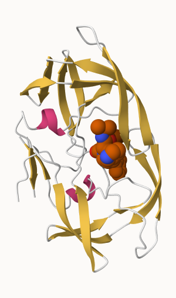

# Class10
Neva Olliffe PID: A69026930

# 1. Intro to PDB

``` r
library(tidyverse)
```

    Warning: package 'tidyverse' was built under R version 4.3.2

    Warning: package 'readr' was built under R version 4.3.2

    Warning: package 'forcats' was built under R version 4.3.2

    Warning: package 'lubridate' was built under R version 4.3.2

    ── Attaching core tidyverse packages ──────────────────────── tidyverse 2.0.0 ──
    ✔ dplyr     1.1.3     ✔ readr     2.1.4
    ✔ forcats   1.0.0     ✔ stringr   1.5.0
    ✔ ggplot2   3.4.4     ✔ tibble    3.2.1
    ✔ lubridate 1.9.3     ✔ tidyr     1.3.0
    ✔ purrr     1.0.2     
    ── Conflicts ────────────────────────────────────────── tidyverse_conflicts() ──
    ✖ dplyr::filter() masks stats::filter()
    ✖ dplyr::lag()    masks stats::lag()
    ℹ Use the conflicted package (<http://conflicted.r-lib.org/>) to force all conflicts to become errors

``` r
data_summary <- read.csv("Data Export Summary.csv", row.names = 1)

data_summary
```

                              X.ray     EM    NMR Multiple.methods Neutron Other
    Protein (only)          158,844 11,759 12,296              197      73    32
    Protein/Oligosaccharide   9,260  2,054     34                8       1     0
    Protein/NA                8,307  3,667    284                7       0     0
    Nucleic acid (only)       2,730    113  1,467               13       3     1
    Other                       164      9     32                0       0     0
    Oligosaccharide (only)       11      0      6                1       0     4
                              Total
    Protein (only)          183,201
    Protein/Oligosaccharide  11,357
    Protein/NA               12,265
    Nucleic acid (only)       4,327
    Other                       205
    Oligosaccharide (only)       22

## Q1: What percentage of structures in the PDB are solved by X-Ray and Electron Microscopy.

There are 183,201 protein structures and UniProt has 251600768 protein
sequences.

``` r
round(183201/251600768*100, 2)
```

    [1] 0.07

Approximately 7% of proteins have structures - although I don’t know
that this accounts for multiple structures of the same protein.

``` r
# Write function to remove comma from numeric 
toNumeric<- function(x) {
  x_strip <- gsub(",", "", x)
  
  as.numeric(x_strip)
}

# Check how numeric works
toNumeric("10,000")
```

    [1] 10000

``` r
# Create a new df, numeric_data with the numeric data
numeric_data <- data.frame(lapply(data_summary, FUN = toNumeric), row.names = rownames(data_summary))

numeric_data
```

                             X.ray    EM   NMR Multiple.methods Neutron Other
    Protein (only)          158844 11759 12296              197      73    32
    Protein/Oligosaccharide   9260  2054    34                8       1     0
    Protein/NA                8307  3667   284                7       0     0
    Nucleic acid (only)       2730   113  1467               13       3     1
    Other                      164     9    32                0       0     0
    Oligosaccharide (only)      11     0     6                1       0     4
                             Total
    Protein (only)          183201
    Protein/Oligosaccharide  11357
    Protein/NA               12265
    Nucleic acid (only)       4327
    Other                      205
    Oligosaccharide (only)      22

``` r
sum(numeric_data$X.ray,numeric_data$EM) / sum(numeric_data$Total) * 100
```

    [1] 93.15962

93% of structures are solved by EM and X-Ray.

## Q2: What proportion of structures in the PDB are protein?

``` r
sum(numeric_data[1:3,7])/sum(numeric_data$Total) * 100
```

    [1] 97.84556

98% of structures are protein.

## Q3: Type HIV in the PDB website search box on the home page and determine how many HIV-1 protease structures are in the current PDB?

I did a sub-query for “protease” and selected proteins only and got 1603
structures.

# 2. Visualizing HIV protease

## Q4: Water molecules normally have 3 atoms. Why do we see just one atom per water molecule in this structure?

There are no hydrogens displayed in this structure because the
resolution was not high enough to resolve hydrogen.

 

## Q5: There is a critical “conserved” water molecule in the binding site. Can you identify this water molecule? What residue number does this water molecule have

This is HOH 308.

\#3. Intro to Bio3D

``` r
library(bio3d)
```

    Warning: package 'bio3d' was built under R version 4.3.2

``` r
pdb <- read.pdb("1hsg")
```

      Note: Accessing on-line PDB file

``` r
pdb
```


     Call:  read.pdb(file = "1hsg")

       Total Models#: 1
         Total Atoms#: 1686,  XYZs#: 5058  Chains#: 2  (values: A B)

         Protein Atoms#: 1514  (residues/Calpha atoms#: 198)
         Nucleic acid Atoms#: 0  (residues/phosphate atoms#: 0)

         Non-protein/nucleic Atoms#: 172  (residues: 128)
         Non-protein/nucleic resid values: [ HOH (127), MK1 (1) ]

       Protein sequence:
          PQITLWQRPLVTIKIGGQLKEALLDTGADDTVLEEMSLPGRWKPKMIGGIGGFIKVRQYD
          QILIEICGHKAIGTVLVGPTPVNIIGRNLLTQIGCTLNFPQITLWQRPLVTIKIGGQLKE
          ALLDTGADDTVLEEMSLPGRWKPKMIGGIGGFIKVRQYDQILIEICGHKAIGTVLVGPTP
          VNIIGRNLLTQIGCTLNF

    + attr: atom, xyz, seqres, helix, sheet,
            calpha, remark, call

## Q7: How many amino acid residues are there in this pdb object?

198 amino acid residues.

## Q8: Name one of the two non-protein residues?

HOH and MK1.

## Q9: How many protein chains are in this structure?

2.  

``` r
adk <- read.pdb("6s36")
```

      Note: Accessing on-line PDB file
       PDB has ALT records, taking A only, rm.alt=TRUE

``` r
adk
```


     Call:  read.pdb(file = "6s36")

       Total Models#: 1
         Total Atoms#: 1898,  XYZs#: 5694  Chains#: 1  (values: A)

         Protein Atoms#: 1654  (residues/Calpha atoms#: 214)
         Nucleic acid Atoms#: 0  (residues/phosphate atoms#: 0)

         Non-protein/nucleic Atoms#: 244  (residues: 244)
         Non-protein/nucleic resid values: [ CL (3), HOH (238), MG (2), NA (1) ]

       Protein sequence:
          MRIILLGAPGAGKGTQAQFIMEKYGIPQISTGDMLRAAVKSGSELGKQAKDIMDAGKLVT
          DELVIALVKERIAQEDCRNGFLLDGFPRTIPQADAMKEAGINVDYVLEFDVPDELIVDKI
          VGRRVHAPSGRVYHVKFNPPKVEGKDDVTGEELTTRKDDQEETVRKRLVEYHQMTAPLIG
          YYSKEAEAGNTKYAKVDGTKPVAEVRADLEKILG

    + attr: atom, xyz, seqres, helix, sheet,
            calpha, remark, call

``` r
# Perform flexiblity prediction
m <- nma(adk)
```

     Building Hessian...        Done in 0.03 seconds.
     Diagonalizing Hessian...   Done in 0.29 seconds.

``` r
plot(m)
```


``` r
mktrj(m, file="adk_m7.pdb")
```
