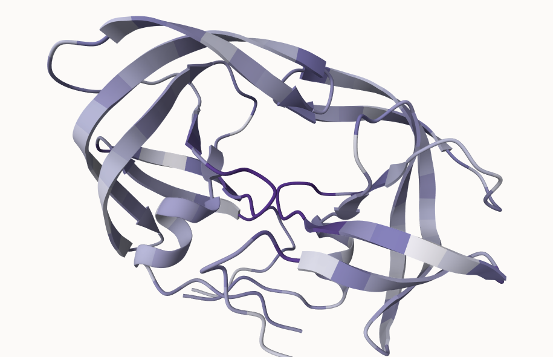

# Class11
Neva Olliffe PID A69026930

``` r
# Change this for YOUR results dir name
results_dir <- "hivprdimer_23119/" 
```

``` r
# File names for all PDB models
pdb_files <- list.files(path=results_dir,
                        pattern="*.pdb",
                        full.names = TRUE)

# Print our PDB file names
basename(pdb_files)
```

    [1] "hivprdimer_23119_unrelaxed_rank_001_alphafold2_multimer_v3_model_1_seed_000.pdb"
    [2] "hivprdimer_23119_unrelaxed_rank_002_alphafold2_multimer_v3_model_5_seed_000.pdb"
    [3] "hivprdimer_23119_unrelaxed_rank_003_alphafold2_multimer_v3_model_4_seed_000.pdb"
    [4] "hivprdimer_23119_unrelaxed_rank_004_alphafold2_multimer_v3_model_2_seed_000.pdb"
    [5] "hivprdimer_23119_unrelaxed_rank_005_alphafold2_multimer_v3_model_3_seed_000.pdb"

We need to align and superimpose the PDB models using `pdbaln()`.

``` r
library(bio3d)
```

    Warning: package 'bio3d' was built under R version 4.3.2

``` r
# Read all data from Models 
#  and superpose/fit coords
pdbs <- pdbaln(pdb_files, fit=TRUE, exefile="msa")
```

    Reading PDB files:
    hivprdimer_23119/hivprdimer_23119_unrelaxed_rank_001_alphafold2_multimer_v3_model_1_seed_000.pdb
    hivprdimer_23119/hivprdimer_23119_unrelaxed_rank_002_alphafold2_multimer_v3_model_5_seed_000.pdb
    hivprdimer_23119/hivprdimer_23119_unrelaxed_rank_003_alphafold2_multimer_v3_model_4_seed_000.pdb
    hivprdimer_23119/hivprdimer_23119_unrelaxed_rank_004_alphafold2_multimer_v3_model_2_seed_000.pdb
    hivprdimer_23119/hivprdimer_23119_unrelaxed_rank_005_alphafold2_multimer_v3_model_3_seed_000.pdb
    .....

    Extracting sequences

    pdb/seq: 1   name: hivprdimer_23119/hivprdimer_23119_unrelaxed_rank_001_alphafold2_multimer_v3_model_1_seed_000.pdb 
    pdb/seq: 2   name: hivprdimer_23119/hivprdimer_23119_unrelaxed_rank_002_alphafold2_multimer_v3_model_5_seed_000.pdb 
    pdb/seq: 3   name: hivprdimer_23119/hivprdimer_23119_unrelaxed_rank_003_alphafold2_multimer_v3_model_4_seed_000.pdb 
    pdb/seq: 4   name: hivprdimer_23119/hivprdimer_23119_unrelaxed_rank_004_alphafold2_multimer_v3_model_2_seed_000.pdb 
    pdb/seq: 5   name: hivprdimer_23119/hivprdimer_23119_unrelaxed_rank_005_alphafold2_multimer_v3_model_3_seed_000.pdb 

``` r
pdbs
```

                                   1        .         .         .         .         50 
    [Truncated_Name:1]hivprdimer   PQITLWQRPLVTIKIGGQLKEALLDTGADDTVLEEMSLPGRWKPKMIGGI
    [Truncated_Name:2]hivprdimer   PQITLWQRPLVTIKIGGQLKEALLDTGADDTVLEEMSLPGRWKPKMIGGI
    [Truncated_Name:3]hivprdimer   PQITLWQRPLVTIKIGGQLKEALLDTGADDTVLEEMSLPGRWKPKMIGGI
    [Truncated_Name:4]hivprdimer   PQITLWQRPLVTIKIGGQLKEALLDTGADDTVLEEMSLPGRWKPKMIGGI
    [Truncated_Name:5]hivprdimer   PQITLWQRPLVTIKIGGQLKEALLDTGADDTVLEEMSLPGRWKPKMIGGI
                                   ************************************************** 
                                   1        .         .         .         .         50 

                                  51        .         .         .         .         100 
    [Truncated_Name:1]hivprdimer   GGFIKVRQYDQILIEICGHKAIGTVLVGPTPVNIIGRNLLTQIGCTLNFP
    [Truncated_Name:2]hivprdimer   GGFIKVRQYDQILIEICGHKAIGTVLVGPTPVNIIGRNLLTQIGCTLNFP
    [Truncated_Name:3]hivprdimer   GGFIKVRQYDQILIEICGHKAIGTVLVGPTPVNIIGRNLLTQIGCTLNFP
    [Truncated_Name:4]hivprdimer   GGFIKVRQYDQILIEICGHKAIGTVLVGPTPVNIIGRNLLTQIGCTLNFP
    [Truncated_Name:5]hivprdimer   GGFIKVRQYDQILIEICGHKAIGTVLVGPTPVNIIGRNLLTQIGCTLNFP
                                   ************************************************** 
                                  51        .         .         .         .         100 

                                 101        .         .         .         .         150 
    [Truncated_Name:1]hivprdimer   QITLWQRPLVTIKIGGQLKEALLDTGADDTVLEEMSLPGRWKPKMIGGIG
    [Truncated_Name:2]hivprdimer   QITLWQRPLVTIKIGGQLKEALLDTGADDTVLEEMSLPGRWKPKMIGGIG
    [Truncated_Name:3]hivprdimer   QITLWQRPLVTIKIGGQLKEALLDTGADDTVLEEMSLPGRWKPKMIGGIG
    [Truncated_Name:4]hivprdimer   QITLWQRPLVTIKIGGQLKEALLDTGADDTVLEEMSLPGRWKPKMIGGIG
    [Truncated_Name:5]hivprdimer   QITLWQRPLVTIKIGGQLKEALLDTGADDTVLEEMSLPGRWKPKMIGGIG
                                   ************************************************** 
                                 101        .         .         .         .         150 

                                 151        .         .         .         .       198 
    [Truncated_Name:1]hivprdimer   GFIKVRQYDQILIEICGHKAIGTVLVGPTPVNIIGRNLLTQIGCTLNF
    [Truncated_Name:2]hivprdimer   GFIKVRQYDQILIEICGHKAIGTVLVGPTPVNIIGRNLLTQIGCTLNF
    [Truncated_Name:3]hivprdimer   GFIKVRQYDQILIEICGHKAIGTVLVGPTPVNIIGRNLLTQIGCTLNF
    [Truncated_Name:4]hivprdimer   GFIKVRQYDQILIEICGHKAIGTVLVGPTPVNIIGRNLLTQIGCTLNF
    [Truncated_Name:5]hivprdimer   GFIKVRQYDQILIEICGHKAIGTVLVGPTPVNIIGRNLLTQIGCTLNF
                                   ************************************************ 
                                 151        .         .         .         .       198 

    Call:
      pdbaln(files = pdb_files, fit = TRUE, exefile = "msa")

    Class:
      pdbs, fasta

    Alignment dimensions:
      5 sequence rows; 198 position columns (198 non-gap, 0 gap) 

    + attr: xyz, resno, b, chain, id, ali, resid, sse, call

# RMSD

The RMSD (root mean square distance) matrix is a common measure of
structural dissimilarity.

``` r
rd <- rmsd(pdbs, fit=T)
```

    Warning in rmsd(pdbs, fit = T): No indices provided, using the 198 non NA positions

``` r
range(rd)
```

    [1]  0.000 14.689

``` r
## Draw a heat map of RMSD matrix values
library(pheatmap)
```

    Warning: package 'pheatmap' was built under R version 4.3.2

``` r
colnames(rd) <- paste0("m",1:5)
rownames(rd) <- paste0("m",1:5)
pheatmap(rd)
```


``` r
# Read a reference PDB structure
pdb <- read.pdb("1hsg")
```

      Note: Accessing on-line PDB file

``` r
plotb3(pdbs$b[1,], typ="l", lwd=2, sse=pdb)
points(pdbs$b[2,], typ="l", col="red")
points(pdbs$b[3,], typ="l", col="blue")
points(pdbs$b[4,], typ="l", col="darkgreen")
points(pdbs$b[5,], typ="l", col="orange")
abline(v=100, col="gray")
```


If we plot the models now, they do not work well. The different chains
are in different conformations, so we want to call a rigid “core” of the
molecules to superimpose around.

``` r
# Find a rigid core amongst the structures
core <- core.find(pdbs)
```

     core size 197 of 198  vol = 6154.839 
     core size 196 of 198  vol = 5399.676 
     core size 195 of 198  vol = 5074.795 
     core size 194 of 198  vol = 4802.518 
     core size 193 of 198  vol = 4520.256 
     core size 192 of 198  vol = 4305.362 
     core size 191 of 198  vol = 4089.792 
     core size 190 of 198  vol = 3886.145 
     core size 189 of 198  vol = 3758.321 
     core size 188 of 198  vol = 3620.18 
     core size 187 of 198  vol = 3496.698 
     core size 186 of 198  vol = 3389.985 
     core size 185 of 198  vol = 3320.114 
     core size 184 of 198  vol = 3258.683 
     core size 183 of 198  vol = 3208.591 
     core size 182 of 198  vol = 3156.736 
     core size 181 of 198  vol = 3141.668 
     core size 180 of 198  vol = 3136.574 
     core size 179 of 198  vol = 3155.52 
     core size 178 of 198  vol = 3185.362 
     core size 177 of 198  vol = 3204.487 
     core size 176 of 198  vol = 3211.978 
     core size 175 of 198  vol = 3234.993 
     core size 174 of 198  vol = 3244.062 
     core size 173 of 198  vol = 3237.845 
     core size 172 of 198  vol = 3218.77 
     core size 171 of 198  vol = 3180.743 
     core size 170 of 198  vol = 3130.369 
     core size 169 of 198  vol = 3067.881 
     core size 168 of 198  vol = 2989.546 
     core size 167 of 198  vol = 2928.272 
     core size 166 of 198  vol = 2851.193 
     core size 165 of 198  vol = 2780.877 
     core size 164 of 198  vol = 2708.433 
     core size 163 of 198  vol = 2636.516 
     core size 162 of 198  vol = 2563.25 
     core size 161 of 198  vol = 2478.024 
     core size 160 of 198  vol = 2404.793 
     core size 159 of 198  vol = 2330.997 
     core size 158 of 198  vol = 2250.477 
     core size 157 of 198  vol = 2159.432 
     core size 156 of 198  vol = 2070.759 
     core size 155 of 198  vol = 1983.579 
     core size 154 of 198  vol = 1917.913 
     core size 153 of 198  vol = 1842.556 
     core size 152 of 198  vol = 1775.398 
     core size 151 of 198  vol = 1695.133 
     core size 150 of 198  vol = 1632.173 
     core size 149 of 198  vol = 1570.391 
     core size 148 of 198  vol = 1497.238 
     core size 147 of 198  vol = 1434.802 
     core size 146 of 198  vol = 1367.706 
     core size 145 of 198  vol = 1302.596 
     core size 144 of 198  vol = 1251.985 
     core size 143 of 198  vol = 1207.976 
     core size 142 of 198  vol = 1167.112 
     core size 141 of 198  vol = 1118.27 
     core size 140 of 198  vol = 1081.664 
     core size 139 of 198  vol = 1029.75 
     core size 138 of 198  vol = 981.766 
     core size 137 of 198  vol = 944.446 
     core size 136 of 198  vol = 899.224 
     core size 135 of 198  vol = 859.402 
     core size 134 of 198  vol = 814.694 
     core size 133 of 198  vol = 771.862 
     core size 132 of 198  vol = 733.807 
     core size 131 of 198  vol = 702.053 
     core size 130 of 198  vol = 658.757 
     core size 129 of 198  vol = 622.574 
     core size 128 of 198  vol = 578.29 
     core size 127 of 198  vol = 543.07 
     core size 126 of 198  vol = 510.934 
     core size 125 of 198  vol = 481.595 
     core size 124 of 198  vol = 464.672 
     core size 123 of 198  vol = 451.721 
     core size 122 of 198  vol = 430.417 
     core size 121 of 198  vol = 409.141 
     core size 120 of 198  vol = 378.942 
     core size 119 of 198  vol = 348.325 
     core size 118 of 198  vol = 324.738 
     core size 117 of 198  vol = 312.394 
     core size 116 of 198  vol = 300.89 
     core size 115 of 198  vol = 279.976 
     core size 114 of 198  vol = 263.434 
     core size 113 of 198  vol = 250.263 
     core size 112 of 198  vol = 229.592 
     core size 111 of 198  vol = 209.929 
     core size 110 of 198  vol = 196.379 
     core size 109 of 198  vol = 180.628 
     core size 108 of 198  vol = 167.088 
     core size 107 of 198  vol = 155.875 
     core size 106 of 198  vol = 142.595 
     core size 105 of 198  vol = 128.924 
     core size 104 of 198  vol = 114.054 
     core size 103 of 198  vol = 100.936 
     core size 102 of 198  vol = 90.431 
     core size 101 of 198  vol = 81.972 
     core size 100 of 198  vol = 74.017 
     core size 99 of 198  vol = 66.855 
     core size 98 of 198  vol = 59.525 
     core size 97 of 198  vol = 52.263 
     core size 96 of 198  vol = 43.699 
     core size 95 of 198  vol = 35.813 
     core size 94 of 198  vol = 28.888 
     core size 93 of 198  vol = 20.692 
     core size 92 of 198  vol = 14.975 
     core size 91 of 198  vol = 9.146 
     core size 90 of 198  vol = 5.232 
     core size 89 of 198  vol = 3.53 
     core size 88 of 198  vol = 2.657 
     core size 87 of 198  vol = 1.998 
     core size 86 of 198  vol = 1.333 
     core size 85 of 198  vol = 1.141 
     core size 84 of 198  vol = 1.012 
     core size 83 of 198  vol = 0.891 
     core size 82 of 198  vol = 0.749 
     core size 81 of 198  vol = 0.618 
     core size 80 of 198  vol = 0.538 
     core size 79 of 198  vol = 0.479 
     FINISHED: Min vol ( 0.5 ) reached

``` r
core.inds <- print(core, vol=0.5)
```

    # 80 positions (cumulative volume <= 0.5 Angstrom^3) 
      start end length
    1    10  25     16
    2    27  48     22
    3    53  94     42

``` r
xyz <- pdbfit(pdbs, core.inds, outpath="corefit_structures")
```

``` r
# Examine RMSDs
rf <- rmsf(xyz)

plotb3(rf, sse=pdb)
abline(v=100, col="gray", ylab="RMSF")
```


To evaluate how good multi-chain or multi-domain models are we need to
look at the PAE scores (predicted aligned errors).

These are output as JSON format files.

``` r
pae_files <- list.files(results_dir, pattern = "0.json", full.names = TRUE)
pae_files
```

    [1] "hivprdimer_23119/hivprdimer_23119_scores_rank_001_alphafold2_multimer_v3_model_1_seed_000.json"
    [2] "hivprdimer_23119/hivprdimer_23119_scores_rank_002_alphafold2_multimer_v3_model_5_seed_000.json"
    [3] "hivprdimer_23119/hivprdimer_23119_scores_rank_003_alphafold2_multimer_v3_model_4_seed_000.json"
    [4] "hivprdimer_23119/hivprdimer_23119_scores_rank_004_alphafold2_multimer_v3_model_2_seed_000.json"
    [5] "hivprdimer_23119/hivprdimer_23119_scores_rank_005_alphafold2_multimer_v3_model_3_seed_000.json"

``` r
# Examine PAE
library(jsonlite)

# Listing of all PAE JSON files
pae_files <- list.files(path=results_dir,
                        pattern=".*model.*\\.json",
                        full.names = TRUE)
```

``` r
library(jsonlite)

pae1 <- read_json(pae_files[1], simplifyVector = TRUE)

attributes(pae1)
```

    $names
    [1] "plddt"   "max_pae" "pae"     "ptm"     "iptm"   

``` r
# Look at json files 1 and 5
pae1 <- read_json(pae_files[1],simplifyVector = TRUE)
pae5 <- read_json(pae_files[5],simplifyVector = TRUE)

attributes(pae1)
```

    $names
    [1] "plddt"   "max_pae" "pae"     "ptm"     "iptm"   

``` r
# Per-residue pLDDT scores 
#  same as B-factor of PDB..
head(pae1$plddt) 
```

    [1] 92.50 96.56 96.94 96.62 97.69 96.00

``` r
pae1$max_pae
```

    [1] 15.54688

``` r
pae5$max_pae
```

    [1] 29.29688

model 1 has a better (lower) predicted aligned error than model 5.

## Plot residue by residue PAE

``` r
# plot model 1
plot.dmat(pae1$pae, 
          xlab="Residue Position (i)",
          ylab="Residue Position (j)")
```


``` r
# plot model 5
plot.dmat(pae5$pae, 
          xlab="Residue Position (i)",
          ylab="Residue Position (j)",
          grid.col = "black",
          zlim=c(0,30))
```


``` r
# Re-plot model 1 using same scale as model 5
plot.dmat(pae1$pae, 
          xlab="Residue Position (i)",
          ylab="Residue Position (j)",
          grid.col = "black",
          zlim=c(0,30))
```


``` r
# Look at alignment
aln_file <- list.files(path=results_dir,
                       pattern=".a3m$",
                        full.names = TRUE)
aln_file
```

    [1] "hivprdimer_23119/hivprdimer_23119.a3m"

``` r
# Alignment info
aln <- read.fasta(aln_file[1], to.upper = TRUE)
```

    [1] " ** Duplicated sequence id's: 101 **"
    [2] " ** Duplicated sequence id's: 101 **"

``` r
dim(aln$ali)
```

    [1] 5378  132

``` r
# Look at conservation 
sim <- conserv(aln)
plotb3(sim[1:99], sse=trim.pdb(pdb, chain="A"),
       ylab="Conservation Score")
```


``` r
# Look at conserved residues by sequence
con <- consensus(aln, cutoff = 0.9)
con$seq
```

      [1] "-" "-" "-" "-" "-" "-" "-" "-" "-" "-" "-" "-" "-" "-" "-" "-" "-" "-"
     [19] "-" "-" "-" "-" "-" "-" "D" "T" "G" "A" "-" "-" "-" "-" "-" "-" "-" "-"
     [37] "-" "-" "-" "-" "-" "-" "-" "-" "-" "-" "-" "-" "-" "-" "-" "-" "-" "-"
     [55] "-" "-" "-" "-" "-" "-" "-" "-" "-" "-" "-" "-" "-" "-" "-" "-" "-" "-"
     [73] "-" "-" "-" "-" "-" "-" "-" "-" "-" "-" "-" "-" "-" "-" "-" "-" "-" "-"
     [91] "-" "-" "-" "-" "-" "-" "-" "-" "-" "-" "-" "-" "-" "-" "-" "-" "-" "-"
    [109] "-" "-" "-" "-" "-" "-" "-" "-" "-" "-" "-" "-" "-" "-" "-" "-" "-" "-"
    [127] "-" "-" "-" "-" "-" "-"

The 4 conserved residues are in the active site.

``` r
# Generate pdb file for mol*
m1.pdb <- read.pdb(pdb_files[1])
occ <- vec2resno(c(sim[1:99], sim[1:99]), m1.pdb$atom$resno)
write.pdb(m1.pdb, o=occ, file="m1_conserv.pdb")
```



## Main points: We can run alphafold on google compute infrastructure (jupytr notebook). We do need to do the interpretation of the results by reading them into R. It is usefull to look at the PAE and pLDDT scores.
