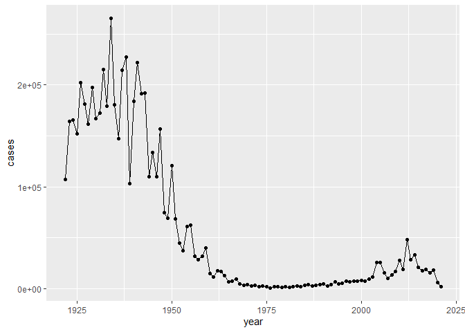
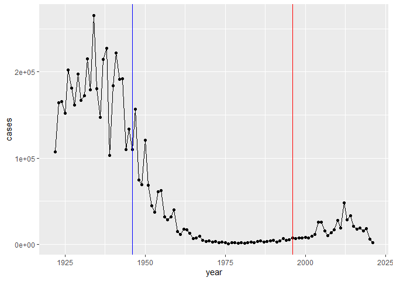
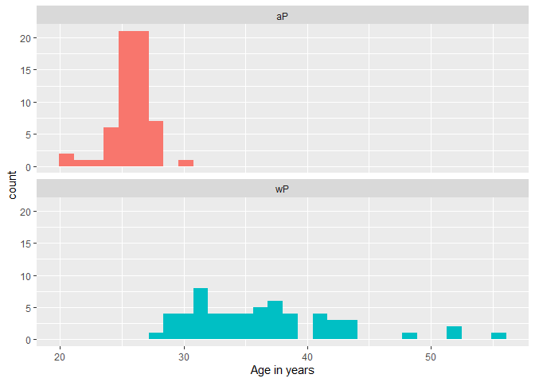
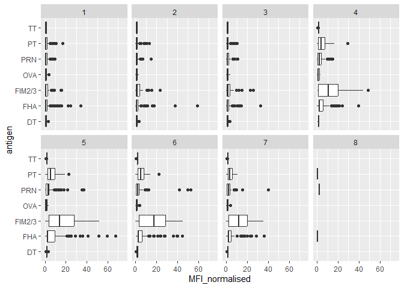
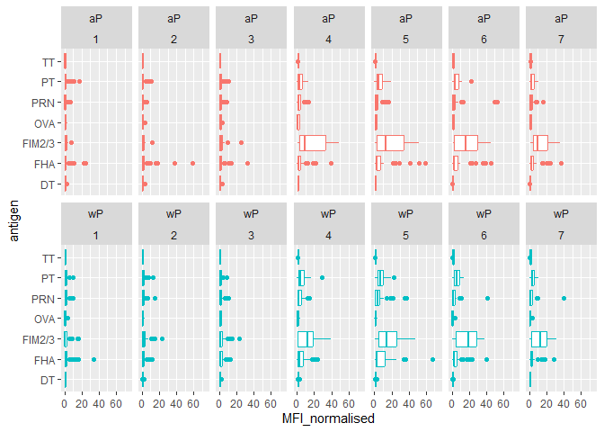
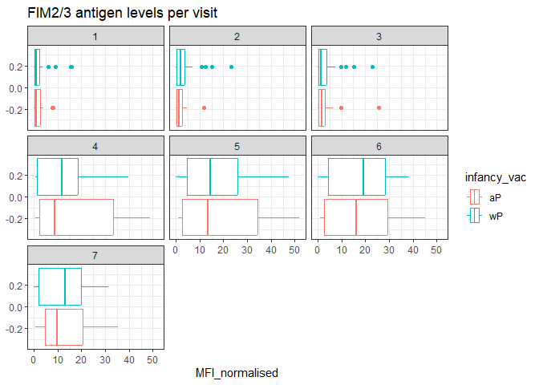
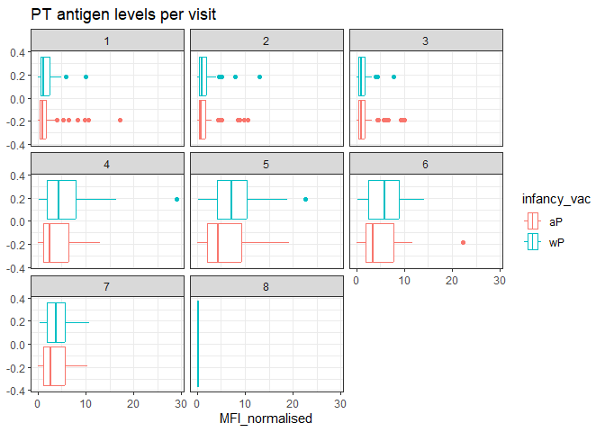
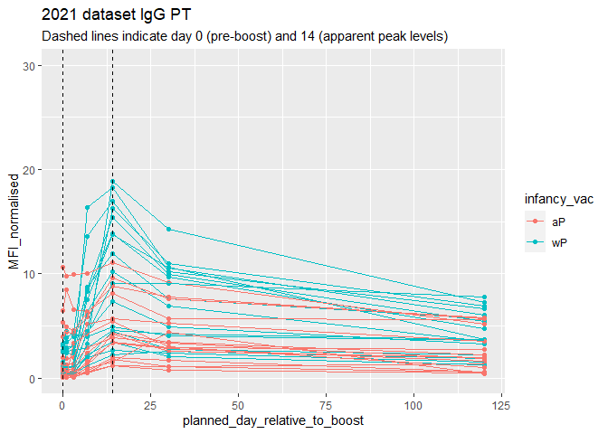
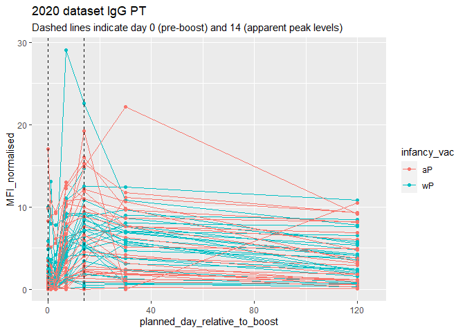
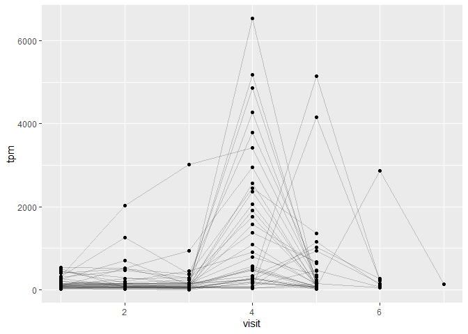

# class19
Neva Olliffe A69026930

# Pertussis cases by year

## Q1. With the help of the R “addin” package datapasta assign the CDC pertussis case number data to a data frame called cdc and use ggplot to make a plot of cases numbers over time.

``` r
library(datapasta)
```

    Warning: package 'datapasta' was built under R version 4.3.2

``` r
cdc <- data.frame(
                          year = c(1922L,
                                   1923L,1924L,1925L,1926L,1927L,1928L,
                                   1929L,1930L,1931L,1932L,1933L,1934L,1935L,
                                   1936L,1937L,1938L,1939L,1940L,1941L,
                                   1942L,1943L,1944L,1945L,1946L,1947L,1948L,
                                   1949L,1950L,1951L,1952L,1953L,1954L,
                                   1955L,1956L,1957L,1958L,1959L,1960L,
                                   1961L,1962L,1963L,1964L,1965L,1966L,1967L,
                                   1968L,1969L,1970L,1971L,1972L,1973L,
                                   1974L,1975L,1976L,1977L,1978L,1979L,1980L,
                                   1981L,1982L,1983L,1984L,1985L,1986L,
                                   1987L,1988L,1989L,1990L,1991L,1992L,1993L,
                                   1994L,1995L,1996L,1997L,1998L,1999L,
                                   2000L,2001L,2002L,2003L,2004L,2005L,
                                   2006L,2007L,2008L,2009L,2010L,2011L,2012L,
                                   2013L,2014L,2015L,2016L,2017L,2018L,
                                   2019L, 2020L, 2021L),
  cases = c(107473,
                                   164191,165418,152003,202210,181411,
                                   161799,197371,166914,172559,215343,179135,
                                   265269,180518,147237,214652,227319,103188,
                                   183866,222202,191383,191890,109873,
                                   133792,109860,156517,74715,69479,120718,
                                   68687,45030,37129,60886,62786,31732,28295,
                                   32148,40005,14809,11468,17749,17135,
                                   13005,6799,7717,9718,4810,3285,4249,
                                   3036,3287,1759,2402,1738,1010,2177,2063,
                                   1623,1730,1248,1895,2463,2276,3589,
                                   4195,2823,3450,4157,4570,2719,4083,6586,
                                   4617,5137,7796,6564,7405,7298,7867,
                                   7580,9771,11647,25827,25616,15632,10454,
                                   13278,16858,27550,18719,48277,28639,
                                   32971,20762,17972,18975,15609,18617,6124,2116)
)

head(cdc)
```

      year  cases
    1 1922 107473
    2 1923 164191
    3 1924 165418
    4 1925 152003
    5 1926 202210
    6 1927 181411

``` r
library(ggplot2)

ggplot(cdc) + 
  aes(x = year, y = cases) + 
  geom_point() + 
  geom_line()
```



# wP and aP vaccines

## Q2. Using the ggplot geom_vline() function add lines to your previous plot for the 1946 introduction of the wP vaccine and the 1996 switch to aP vaccine (see example in the hint below). What do you notice?

``` r
ggplot(cdc) + 
  aes(x = year, y = cases) + 
  geom_point() + 
  geom_line() + 
  geom_vline(xintercept = 1946, col = "blue") + 
  geom_vline(xintercept = 1996, col = "red")
```



## Q3. Describe what happened after the introduction of the aP vaccine? Do you have a possible explanation for the observed trend?

After the 1996 switch to the aP vaccine, cases rose above the extremely
low levels observed iwth the wP vaccine. This is likely because whole
cell vaccines are induce stronger and more long-term immunity than
cell-free vaccines, as well as increased anti-vax sentiment in society.
Together this would reuslt in an overall reduction of herd immunity.

# CMI-PB data

``` r
library(jsonlite)

subject <- read_json("https://www.cmi-pb.org/api/subject", simplifyVector = TRUE) 
head(subject, 3)
```

      subject_id infancy_vac biological_sex              ethnicity  race
    1          1          wP         Female Not Hispanic or Latino White
    2          2          wP         Female Not Hispanic or Latino White
    3          3          wP         Female                Unknown White
      year_of_birth date_of_boost      dataset
    1    1986-01-01    2016-09-12 2020_dataset
    2    1968-01-01    2019-01-28 2020_dataset
    3    1983-01-01    2016-10-10 2020_dataset

\##Q4. How many aP and wP infancy vaccinated subjects are in the
dataset?

``` r
table(subject$infancy_vac)
```


    aP wP 
    60 58 

## Q5. How many Male and Female subjects/patients are in the dataset?

``` r
table(subject$biological_sex)
```


    Female   Male 
        79     39 

## Q6. What is the breakdown of race and biological sex (e.g. number of Asian females, White males etc…)?

``` r
table( subject$race,subject$biological_sex)
```

                                               
                                                Female Male
      American Indian/Alaska Native                  0    1
      Asian                                         21   11
      Black or African American                      2    0
      More Than One Race                             9    2
      Native Hawaiian or Other Pacific Islander      1    1
      Unknown or Not Reported                       11    4
      White                                         35   20

## Q7. Using this approach determine (i) the average age of wP individuals, (ii) the average age of aP individuals; and (iii) are they significantly different?

``` r
library(lubridate)
```

    Warning: package 'lubridate' was built under R version 4.3.2


    Attaching package: 'lubridate'

    The following objects are masked from 'package:base':

        date, intersect, setdiff, union

``` r
library(tidyverse)
```

    Warning: package 'tidyverse' was built under R version 4.3.2

    Warning: package 'readr' was built under R version 4.3.2

    Warning: package 'forcats' was built under R version 4.3.2

    ── Attaching core tidyverse packages ──────────────────────── tidyverse 2.0.0 ──
    ✔ dplyr   1.1.3     ✔ stringr 1.5.0
    ✔ forcats 1.0.0     ✔ tibble  3.2.1
    ✔ purrr   1.0.2     ✔ tidyr   1.3.0
    ✔ readr   2.1.4     

    ── Conflicts ────────────────────────────────────────── tidyverse_conflicts() ──
    ✖ dplyr::filter()  masks stats::filter()
    ✖ purrr::flatten() masks jsonlite::flatten()
    ✖ dplyr::lag()     masks stats::lag()
    ℹ Use the conflicted package (<http://conflicted.r-lib.org/>) to force all conflicts to become errors

``` r
subject_ages <- subject %>% mutate(age = time_length(today() - ymd(year_of_birth), "years"))

subject_ages %>% group_by(infancy_vac) %>%
  summarize(mean(age))
```

    # A tibble: 2 × 2
      infancy_vac `mean(age)`
      <chr>             <dbl>
    1 aP                 26.0
    2 wP                 36.3

``` r
wp <- subject_ages %>% filter(infancy_vac == "wP")
ap <- subject_ages %>% filter(infancy_vac == "aP")

summary(wp$age, "years")
```

       Min. 1st Qu.  Median    Mean 3rd Qu.    Max. 
      27.93   31.18   35.43   36.33   38.93   55.93 

``` r
summary(ap$age, "years")
```

       Min. 1st Qu.  Median    Mean 3rd Qu.    Max. 
      20.93   25.93   25.93   26.03   26.93   29.93 

Yes, they are very different - the 3rd quartile of the aP ages is
younger than the minimum wP age.

## Q8. Determine the age of all individuals at time of boost?

``` r
subject_ages <- subject_ages %>% mutate(age_at_boost = time_length(ymd(date_of_boost) - ymd(year_of_birth), "years"))

head(subject_ages)
```

      subject_id infancy_vac biological_sex              ethnicity  race
    1          1          wP         Female Not Hispanic or Latino White
    2          2          wP         Female Not Hispanic or Latino White
    3          3          wP         Female                Unknown White
    4          4          wP           Male Not Hispanic or Latino Asian
    5          5          wP           Male Not Hispanic or Latino Asian
    6          6          wP         Female Not Hispanic or Latino White
      year_of_birth date_of_boost      dataset      age age_at_boost
    1    1986-01-01    2016-09-12 2020_dataset 37.93292     30.69678
    2    1968-01-01    2019-01-28 2020_dataset 55.93429     51.07461
    3    1983-01-01    2016-10-10 2020_dataset 40.93361     33.77413
    4    1988-01-01    2016-08-29 2020_dataset 35.93429     28.65982
    5    1991-01-01    2016-08-29 2020_dataset 32.93361     25.65914
    6    1988-01-01    2016-10-10 2020_dataset 35.93429     28.77481

## Q9. With the help of a faceted boxplot or histogram (see below), do you think these two groups are significantly different?

``` r
ggplot(subject_ages) +
  aes(age,
      fill=as.factor(infancy_vac)) +
  geom_histogram(show.legend=FALSE) +
  facet_wrap(vars(infancy_vac), nrow=2) +
  xlab("Age in years")
```

    `stat_bin()` using `bins = 30`. Pick better value with `binwidth`.



Yes, the wP and aP groups look very different in age.

``` r
# Complete the API URLs...
specimen <- read_json("https://www.cmi-pb.org/api/specimen", simplifyVector = TRUE) 
titer <- read_json("https://www.cmi-pb.org/api/plasma_ab_titer", simplifyVector = TRUE) 
```

## Q9. Complete the code to join specimen and subject tables to make a new merged data frame containing all specimen records along with their associated subject details:

``` r
meta <- inner_join(specimen, subject)
```

    Joining with `by = join_by(subject_id)`

``` r
dim(meta)
```

    [1] 939  13

``` r
head(meta)
```

      specimen_id subject_id actual_day_relative_to_boost
    1           1          1                           -3
    2           2          1                            1
    3           3          1                            3
    4           4          1                            7
    5           5          1                           11
    6           6          1                           32
      planned_day_relative_to_boost specimen_type visit infancy_vac biological_sex
    1                             0         Blood     1          wP         Female
    2                             1         Blood     2          wP         Female
    3                             3         Blood     3          wP         Female
    4                             7         Blood     4          wP         Female
    5                            14         Blood     5          wP         Female
    6                            30         Blood     6          wP         Female
                   ethnicity  race year_of_birth date_of_boost      dataset
    1 Not Hispanic or Latino White    1986-01-01    2016-09-12 2020_dataset
    2 Not Hispanic or Latino White    1986-01-01    2016-09-12 2020_dataset
    3 Not Hispanic or Latino White    1986-01-01    2016-09-12 2020_dataset
    4 Not Hispanic or Latino White    1986-01-01    2016-09-12 2020_dataset
    5 Not Hispanic or Latino White    1986-01-01    2016-09-12 2020_dataset
    6 Not Hispanic or Latino White    1986-01-01    2016-09-12 2020_dataset

## Q10. Now using the same procedure join meta with titer data so we can further analyze this data in terms of time of visit aP/wP, male/female etc.

``` r
abdata <- inner_join(titer, meta)
```

    Joining with `by = join_by(specimen_id)`

``` r
dim(abdata)
```

    [1] 41810    20

``` r
head(abdata)
```

      specimen_id isotype is_antigen_specific antigen        MFI MFI_normalised
    1           1     IgE               FALSE   Total 1110.21154       2.493425
    2           1     IgE               FALSE   Total 2708.91616       2.493425
    3           1     IgG                TRUE      PT   68.56614       3.736992
    4           1     IgG                TRUE     PRN  332.12718       2.602350
    5           1     IgG                TRUE     FHA 1887.12263      34.050956
    6           1     IgE                TRUE     ACT    0.10000       1.000000
       unit lower_limit_of_detection subject_id actual_day_relative_to_boost
    1 UG/ML                 2.096133          1                           -3
    2 IU/ML                29.170000          1                           -3
    3 IU/ML                 0.530000          1                           -3
    4 IU/ML                 6.205949          1                           -3
    5 IU/ML                 4.679535          1                           -3
    6 IU/ML                 2.816431          1                           -3
      planned_day_relative_to_boost specimen_type visit infancy_vac biological_sex
    1                             0         Blood     1          wP         Female
    2                             0         Blood     1          wP         Female
    3                             0         Blood     1          wP         Female
    4                             0         Blood     1          wP         Female
    5                             0         Blood     1          wP         Female
    6                             0         Blood     1          wP         Female
                   ethnicity  race year_of_birth date_of_boost      dataset
    1 Not Hispanic or Latino White    1986-01-01    2016-09-12 2020_dataset
    2 Not Hispanic or Latino White    1986-01-01    2016-09-12 2020_dataset
    3 Not Hispanic or Latino White    1986-01-01    2016-09-12 2020_dataset
    4 Not Hispanic or Latino White    1986-01-01    2016-09-12 2020_dataset
    5 Not Hispanic or Latino White    1986-01-01    2016-09-12 2020_dataset
    6 Not Hispanic or Latino White    1986-01-01    2016-09-12 2020_dataset

## Q11. How many specimens (i.e. entries in abdata) do we have for each isotype?

``` r
table(abdata$isotype)
```


     IgE  IgG IgG1 IgG2 IgG3 IgG4 
    6698 3240 7968 7968 7968 7968 

## Q12. What are the different \$dataset values in abdata and what do you notice about the number of rows for the most “recent” dataset?

``` r
table(abdata$dataset)
```


    2020_dataset 2021_dataset 2022_dataset 
           31520         8085         2205 

The most recent dataset has many fewer entries than the initial dataset.

# 4. Examine IgG Ab titer levels

``` r
# filter for igg isotype
igg <- abdata %>% filter(isotype == "IgG")
head(igg)
```

      specimen_id isotype is_antigen_specific antigen        MFI MFI_normalised
    1           1     IgG                TRUE      PT   68.56614       3.736992
    2           1     IgG                TRUE     PRN  332.12718       2.602350
    3           1     IgG                TRUE     FHA 1887.12263      34.050956
    4          19     IgG                TRUE      PT   20.11607       1.096366
    5          19     IgG                TRUE     PRN  976.67419       7.652635
    6          19     IgG                TRUE     FHA   60.76626       1.096457
       unit lower_limit_of_detection subject_id actual_day_relative_to_boost
    1 IU/ML                 0.530000          1                           -3
    2 IU/ML                 6.205949          1                           -3
    3 IU/ML                 4.679535          1                           -3
    4 IU/ML                 0.530000          3                           -3
    5 IU/ML                 6.205949          3                           -3
    6 IU/ML                 4.679535          3                           -3
      planned_day_relative_to_boost specimen_type visit infancy_vac biological_sex
    1                             0         Blood     1          wP         Female
    2                             0         Blood     1          wP         Female
    3                             0         Blood     1          wP         Female
    4                             0         Blood     1          wP         Female
    5                             0         Blood     1          wP         Female
    6                             0         Blood     1          wP         Female
                   ethnicity  race year_of_birth date_of_boost      dataset
    1 Not Hispanic or Latino White    1986-01-01    2016-09-12 2020_dataset
    2 Not Hispanic or Latino White    1986-01-01    2016-09-12 2020_dataset
    3 Not Hispanic or Latino White    1986-01-01    2016-09-12 2020_dataset
    4                Unknown White    1983-01-01    2016-10-10 2020_dataset
    5                Unknown White    1983-01-01    2016-10-10 2020_dataset
    6                Unknown White    1983-01-01    2016-10-10 2020_dataset

## Q13. Complete the following code to make a summary boxplot of Ab titer levels (MFI) for all antigens:

``` r
ggplot(igg) +
  aes(MFI_normalised, antigen) +
  geom_boxplot() + 
    xlim(0,75) +
  facet_wrap(vars(visit), nrow=2)
```

    Warning: Removed 5 rows containing non-finite values (`stat_boxplot()`).



``` r
lowercase_fim <- abdata %>% filter(antigen=="Fim2/3")
table(lowercase_fim$dataset)
```

    < table of extent 0 >

There’s an error in the 2022 dataset where Fim is written in lowercase
instead of FIM.

## Q14. What antigens show differences in the level of IgG antibody titers recognizing them over time? Why these and not others?

FIM2/3 recognition increases dramatically at visit 4 and remains high
until visit 7.PT, PRN, and FHA also increase. These antigens are all
included in aP vaccines.

``` r
igg %>% filter(visit != 8) %>%
ggplot() +
  aes(MFI_normalised, antigen, col=infancy_vac ) +
  geom_boxplot(show.legend = FALSE) + 
  xlim(0,75) +
  facet_wrap(vars(infancy_vac, visit), nrow=2)
```

    Warning: Removed 5 rows containing non-finite values (`stat_boxplot()`).



## Q15. Filter to pull out only two specific antigens for analysis and create a boxplot for each. You can chose any you like. Below I picked a “control” antigen (“OVA”, that is not in our vaccines) and a clear antigen of interest (“PT”, Pertussis Toxin, one of the key virulence factors produced by the bacterium B. pertussis).

``` r
# Plot for FIM2/3
igg %>% filter(antigen=="FIM2/3") %>%
  ggplot() +
  aes(MFI_normalised, col=infancy_vac) +
  geom_boxplot(show.legend = TRUE) +
  facet_wrap(vars(visit)) +
  theme_bw() + 
  labs(title = "FIM2/3 antigen levels per visit")
```



``` r
# Plot for PT
igg %>% filter(antigen=="PT") %>%
  ggplot() +
  aes(MFI_normalised, col=infancy_vac) +
  geom_boxplot(show.legend = TRUE) +
  facet_wrap(vars(visit)) +
  theme_bw() + 
  labs(title = "PT antigen levels per visit")
```



## Q16. What do you notice about these two antigens time courses and the PT data in particular?

The antigen levels for both dramatically increase at visit for both
vaccine types, and start decreasing at visit 7.

## Q17. Do you see any clear difference in aP vs. wP responses?

The increase in FIM2/3 antigen levels is much stronger in individuals
with aP vaccines, while the levels for TP are similar across the two
vacicine types.

``` r
abdata.21 <- abdata %>% filter(dataset == "2021_dataset")

abdata.21 %>% 
  filter(isotype == "IgG",  antigen == "PT") %>%
  ggplot() +
    aes(x=planned_day_relative_to_boost,
        y=MFI_normalised,
        col=infancy_vac,
        group=subject_id) +
    geom_point() +
    geom_line() +
    ylim(0, 30) +
    geom_vline(xintercept=0, linetype="dashed") +
    geom_vline(xintercept=14, linetype="dashed") +
  labs(title="2021 dataset IgG PT",
       subtitle = "Dashed lines indicate day 0 (pre-boost) and 14 (apparent peak levels)")
```



``` r
abdata.20 <- abdata %>% filter(dataset == "2020_dataset", 
                               isotype == "IgG", antigen == "PT")
ggplot(abdata.20) +
    aes(x=planned_day_relative_to_boost,
        y=MFI_normalised,
        col=infancy_vac,
        group=subject_id) +
    geom_point() +
    geom_line() +
    xlim(0, 125) +
    geom_vline(xintercept=0, linetype="dashed") +
    geom_vline(xintercept=14, linetype="dashed") +
  labs(title="2020 dataset IgG PT",
       subtitle = "Dashed lines indicate day 0 (pre-boost) and 14 (apparent peak levels)")
```

    Warning: Removed 3 rows containing missing values (`geom_point()`).

    Warning: Removed 3 rows containing missing values (`geom_line()`).



## Q18. Does this trend look similar for the 2020 dataset?

The 2021 cohort has a clear difference showing more of an increase in PT
for wP vaccine individuals than aP vaccine individuals. The 2020 cohort
is more mixed, with dramatic increases in some individuals from both
vaccine types, and more of an even mix of increased TP levels in
individuals from both vaccine types.

# CMI-PB RNAseq data

``` r
url <- "https://www.cmi-pb.org/api/v2/rnaseq?versioned_ensembl_gene_id=eq.ENSG00000211896.7"

rna <- read_json(url, simplifyVector = TRUE) 
#meta <- inner_join(specimen, subject)
ssrna <- inner_join(rna, meta)
```

    Joining with `by = join_by(specimen_id)`

## Q19. Make a plot of the time course of gene expression for IGHG1 gene (i.e. a plot of visit vs. tpm).

``` r
ggplot(ssrna) +
  aes(visit, tpm, group=subject_id) +
  geom_point() +
  geom_line(alpha=0.2)
```



## Q20.: What do you notice about the expression of this gene (i.e. when is it at it’s maximum level)?

Expression is maximized at visit 4 for most patients, and visit 5 or 6
for a few.

## Q21. Does this pattern in time match the trend of antibody titer data? If not, why not?

This trend is similar to that of antibody titer data in that both peaks
around visit 4. However, antibody titers remain elevated much longer
than RNA expression remains elevated.
