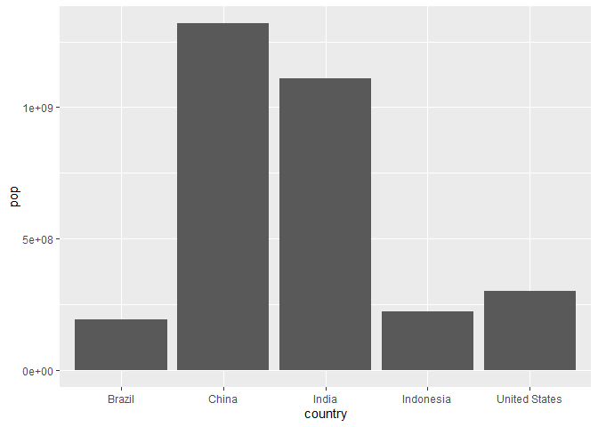
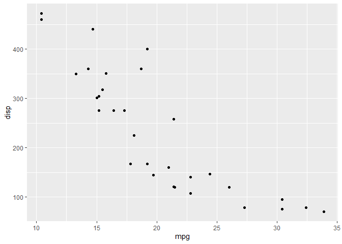

# Class 5: Data Visualization with ggplot
Neva Olliffe (A69026930)

# Using GGPlot

\##Basics with cars Load ggplot2 package before use.

``` r
library(ggplot2)

ggplot(cars)
```


``` r
head(cars)
```

      speed dist
    1     4    2
    2     4   10
    3     7    4
    4     7   22
    5     8   16
    6     9   10

We can use the base R graphics system to plot.

``` r
plot(cars)
```


ggplot requires more information than the base `plot()` function: -
Data, in a `data.frame` - aes - how the data map to the plot - geoms -
how things are drawn

``` r
ggplot(cars)+
  aes(x = speed, y = dist) +
  geom_point() + 
  geom_smooth(method = "lm", se = FALSE) + 
  labs(title = "Speed and stopping distance", 
       x = "Speed (mph)", 
       y = "Distance (feet)", 
       caption = "Dataset: cars") + 
  theme_bw()
```

    `geom_smooth()` using formula = 'y ~ x'


## Switching to gene expression dataset

``` r
url <- "https://bioboot.github.io/bimm143_S20/class-material/up_down_expression.txt"
genes <- read.delim(url)
head(genes)
```

            Gene Condition1 Condition2      State
    1      A4GNT -3.6808610 -3.4401355 unchanging
    2       AAAS  4.5479580  4.3864126 unchanging
    3      AASDH  3.7190695  3.4787276 unchanging
    4       AATF  5.0784720  5.0151916 unchanging
    5       AATK  0.4711421  0.5598642 unchanging
    6 AB015752.4 -3.6808610 -3.5921390 unchanging

Exploring the dataset

``` r
nrow(genes)
```

    [1] 5196

``` r
colnames(genes)
```

    [1] "Gene"       "Condition1" "Condition2" "State"     

``` r
ncol(genes)
```

    [1] 4

``` r
table(genes$State)
```


          down unchanging         up 
            72       4997        127 

Plot the dataset

``` r
p <- ggplot(genes) + 
  aes(x = Condition1, y = Condition2, col=State)+ 
  geom_point() + 
  scale_color_manual(values=c("blue", "gray", "red")) + 
  labs(title = "Gene Expression Changes Upon Drug Treatment", 
       x = "Control (no drug)", 
       y = "Drug Treatment")
p
```


## Switch to gapminder dataset

``` r
# File location online
url <- "https://raw.githubusercontent.com/jennybc/gapminder/master/inst/extdata/gapminder.tsv"

gapminder <- read.delim(url)
head(gapminder)
```

          country continent year lifeExp      pop gdpPercap
    1 Afghanistan      Asia 1952  28.801  8425333  779.4453
    2 Afghanistan      Asia 1957  30.332  9240934  820.8530
    3 Afghanistan      Asia 1962  31.997 10267083  853.1007
    4 Afghanistan      Asia 1967  34.020 11537966  836.1971
    5 Afghanistan      Asia 1972  36.088 13079460  739.9811
    6 Afghanistan      Asia 1977  38.438 14880372  786.1134

### Add dplyr and filter for the year 2007

``` r
library(dplyr)
```


    Attaching package: 'dplyr'

    The following objects are masked from 'package:stats':

        filter, lag

    The following objects are masked from 'package:base':

        intersect, setdiff, setequal, union

``` r
gapminder_2007 <- gapminder %>% filter(year==2007)
```

Simple scatterplot for 2007

``` r
ggplot(gapminder_2007) + 
  aes(x = gdpPercap, y = lifeExp, col = continent, size = pop) + 
  geom_point(alpha = 0.5) +
  scale_size_area(max_size = 10)
```


\###Recapitulate the above process for 1957

``` r
gapminder_1957 <- gapminder %>% filter(year==1957)

ggplot(gapminder_1957) + 
  aes(x = gdpPercap, y = lifeExp, col = continent, size = pop) + 
  geom_point(alpha = 0.7) + 
  scale_size_area(max_size = 15)
```


### Graph both 2007 and 1957

``` r
gapminder_1957_2007 <- gapminder %>% filter(year==1957 | year==2007)

ggplot(gapminder_1957_2007) + 
  aes(x = gdpPercap, y = lifeExp, col = continent, size = pop) + 
  geom_point(alpha = 0.7) + 
  scale_size_area(max_size = 10) + 
  facet_wrap(~year)
```


## Bar charts

Filter for the 5 biggest countries

``` r
gapminder_top5 <- gapminder %>% 
  filter(year==2007) %>%
  arrange(desc(pop)) %>%
  top_n(5, pop)

gapminder_top5
```

            country continent year lifeExp        pop gdpPercap
    1         China      Asia 2007  72.961 1318683096  4959.115
    2         India      Asia 2007  64.698 1110396331  2452.210
    3 United States  Americas 2007  78.242  301139947 42951.653
    4     Indonesia      Asia 2007  70.650  223547000  3540.652
    5        Brazil  Americas 2007  72.390  190010647  9065.801

``` r
ggplot(gapminder_top5) + 
  geom_col() + 
  aes(x = country, y = pop)
```



``` r
ggplot(gapminder_top5) + 
  aes(x = country, y = lifeExp, fill = continent) + 
  geom_col()
```


``` r
ggplot(gapminder_top5) + 
  aes(x = country, y = lifeExp, fill = lifeExp) + 
  geom_col()
```


``` r
ggplot(gapminder_top5) + 
  aes(x = reorder(country, -pop), y= pop, fill = country) + 
  geom_col(col="black")
```


### Flipping bar charts

``` r
USArrests$State <-rownames(USArrests)

ggplot(USArrests) + 
  aes(x = reorder(State, Murder), y = Murder) + 
  geom_point() + 
  geom_segment(aes(x = State, 
                   xend = State, 
                   y = 0, 
                   yend = Murder), 
               color = "blue") + 
  coord_flip()
```


``` r
ggplot(mtcars, aes(mpg, disp)) + geom_point()
```



``` r
ggplot(mtcars) + aes(x=mpg, y=disp) + geom_point()
```


